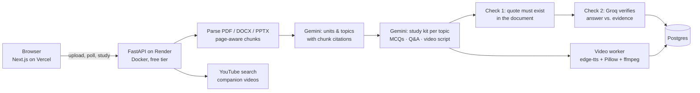

# StudyForge — AI study kits from your own notes

Upload lecture notes, a textbook chapter or a slide deck. StudyForge maps it into **units and topics**, then builds a complete study kit for every topic:

- **MCQ practice tests** with instant feedback, explanations and the exact line from your notes that proves each answer
- **Exam-style theory Q&A** — short and long model answers, with a self-test mode and PDF export
- **Narrated video lessons** — NotebookLM-style: designed slides, AI voice-over, captions and chapters
- **Full mock tests** across every unit, with a per-topic breakdown of what to revise
- **Printable PDFs** — a complete study pack, and practice tests with an answer key

Every answer is **grounded in your document and fact-checked twice** (see [How answers are verified](#how-answers-are-verified)).

**Live demo:** _coming soon_ · no sign-up, and there's a "Try a sample document" button.

---

## Architecture



| Layer | Choice | Why |
| --- | --- | --- |
| Frontend | Next.js 16, React 19, Tailwind CSS v4, SWR | Fast, polished UI; light/dark mode; fully responsive |
| API | FastAPI (async) in Docker on Render | Long-running AI pipelines and video encoding need a real container, not a serverless function |
| Generator | Google Gemini (Flash) with structured JSON output | Large context window reads a whole chapter at once |
| Verifier | Groq (gpt-oss) | A *different* model family checks the generator's work |
| Database | Postgres (Neon / Supabase / Render) via SQLAlchemy async | Everything, including videos, survives restarts on an ephemeral free host |
| Video | edge-tts → Pillow slide renderer → ffmpeg | No paid APIs, no browser; still-image encoding keeps CPU cost tiny |
| PDFs | ReportLab | Study pack and practice tests with answer keys |

## How answers are verified

LLMs can sound confident while being wrong, which is the worst possible failure for a study tool. So every generated question passes two independent checks before you see it:

1. **Deterministic grounding (free, no AI).** The generator must attach a verbatim quote from your document to every MCQ and every answer. The backend normalises text (Unicode, quotes, hyphenation) and confirms the quote actually exists in the cited chunk, using word-pair overlap to tolerate tiny slips. Anything it can't find is **dropped**.
2. **Independent verification.** A second model from a different family (Groq) sees each question, the marked answer and the surrounding evidence, and judges it *supported*, *unsupported* or *ambiguous* (for example, when two options could both be right). Only *supported* items are marked **Verified**.

If the verifier is unavailable, items that passed step 1 are labelled **Source-checked** instead of Verified, so the UI never overstates its confidence. Options are also shuffled deterministically, because models over-use "A" and "B" for correct answers.

## Engineering notes

- **Built for free-tier hosting.** Render's free instance has 512 MB RAM and 0.1 CPU, sleeps after 15 idle minutes, and has an ephemeral disk. So:
  - the pipeline is **idempotent and resumable**: every step is persisted, and on restart `JobManager.recover()` resumes unfinished documents and videos;
  - while jobs run, the API **pings its own public URL** (`RENDER_EXTERNAL_URL`) so the instance doesn't sleep mid-job;
  - the frontend **wakes the API on page load** and explains the wait instead of showing a mysterious spinner;
  - videos are encoded as still images at 5 fps with x264's `stillimage` tune (about 1 MB per minute), and served from Postgres with HTTP Range support.
- **Free-tier quota management.** A sliding-window limiter covers both requests per minute and tokens per minute. The client honours server `retryDelay` hints, discovers which models the key can access, and falls back to another model when one runs out of daily quota (each model has its own free bucket).
- **Progressive UX.** Topic cards appear as soon as the outline is ready, each unlocking as its kit finishes, so you can start studying topic 1 while topic 8 is still being written.
- **Deduplication.** Re-uploading the same file returns the existing study kit instantly (SHA-256 content hash), which saves quota.
- **Graceful degradation.** No YouTube key: targeted search links instead of embeds. TTS outage: gTTS, then a captioned silent video. Verifier outage: Source-checked labels.
- **Tested.** 59 backend tests, including the real Gemini and Groq SDK code paths against mocked HTTP (model fallback, quota exhaustion, bad keys, malformed JSON) and a full upload → video → PDF end-to-end run with an offline provider.

## Project structure

```
backend/
  app/
    main.py            FastAPI app, CORS, lifespan (DB init, job recovery)
    pipeline.py        document → outline → study kits → videos
    jobs.py            in-process job queue, recovery, keep-alive
    routers/           documents, topics, health
    services/
      parsing.py       PDF/DOCX/PPTX/TXT → page-aware chunks
      study.py         outline + study-kit generation
      verify.py        two-layer answer verification
      llm/             Gemini + Groq clients, prompts, schemas, offline fake
      video/           TTS, slide renderer, ffmpeg assembly
      exports.py       PDF study pack / practice tests
      youtube.py       companion videos
  tests/               pytest suite (offline)
frontend/
  app/                 Next.js routes: /, /d/[id], /d/[id]/t/[topicId], /d/[id]/test
  components/          upload, dashboard, quiz player, Q&A, video player, …
  lib/                 API client, backend wake-up, local library & scores
```

## Run locally

**Backend** (Python 3.11+, ffmpeg installed):

```bash
cd backend
python -m venv .venv && source .venv/bin/activate
pip install -r requirements-dev.txt
cp .env.example .env          # add GEMINI_API_KEY and GROQ_API_KEY
uvicorn app.main:app --reload # http://localhost:8000/docs
```

No keys yet? Run `LLM_MODE=fake uvicorn app.main:app` to use the offline generator. It exercises the whole pipeline, including real video rendering.

**Frontend** (Node 20+):

```bash
cd frontend
npm install
NEXT_PUBLIC_API_URL=http://localhost:8000 npm run dev   # http://localhost:3000
```

**Tests:** `cd backend && python -m pytest -q`

## Deploy (free)

1. **Database:** create a free Postgres on [Neon](https://neon.tech) (or Supabase) and copy the connection string.
2. **API → Render:** New → Blueprint → this repo (uses `render.yaml`). Set `DATABASE_URL`, `GEMINI_API_KEY`, `GROQ_API_KEY`, and `FRONTEND_ORIGINS` (your Vercel URL). `YOUTUBE_API_KEY` is optional.
3. **Web → Vercel:** import the repo with root directory `frontend`, and set `NEXT_PUBLIC_API_URL` to your Render URL.
4. Optional: add a repository variable `API_URL` so the daily keep-alive workflow keeps the database active.

| Variable | Where | Required | Notes |
| --- | --- | --- | --- |
| `GEMINI_API_KEY` | Render | yes | [Google AI Studio](https://aistudio.google.com) — free |
| `GROQ_API_KEY` | Render | recommended | [Groq console](https://console.groq.com/keys) — free; enables "Verified" |
| `DATABASE_URL` | Render | yes | any Postgres URL; SQLite is used if unset |
| `FRONTEND_ORIGINS` | Render | yes | comma-separated; `*.vercel.app` previews are allowed automatically |
| `YOUTUBE_API_KEY` | Render | no | embeds real videos instead of search links |
| `TTS_VOICE` | Render | no | any edge-tts voice, e.g. `en-IN-NeerjaNeural` |
| `NEXT_PUBLIC_API_URL` | Vercel | yes | the Render service URL |

## Limitations

- Scanned (image-only) PDFs aren't supported yet; they're detected and rejected with a clear message. OCR is on the roadmap.
- On the free tier, the first request after 15 idle minutes takes 30–60 s while the server wakes.
- Free Gemini and Groq quotas cap how many documents can be processed per day. Repeat uploads are deduplicated and cost nothing.

## Roadmap

OCR for scanned notes · spaced-repetition review of weak topics · multiple documents per study space · voice and language options for videos · "chat with your notes".
